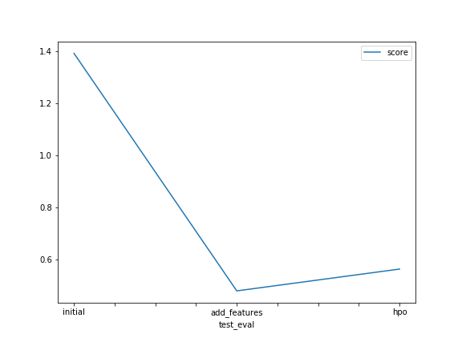

# Report: Predict Bike Sharing Demand with AutoGluon Solution
#### Anika Tabassum

## Initial Training
### What did you realize when you tried to submit your predictions? What changes were needed to the output of the predictor to submit your results?

Kaggle doesn't allow the submission of negative counts, so they need to be converted to zero instead.

### What was the top ranked model that performed?

WeightedEnsemble_L3

## Exploratory data analysis and feature creation
### What did the exploratory analysis find and how did you add additional features?

EDA found that weather and season columns need to contain categorical values so they were converted. EDA also found that datetime contains datetime values, so they were separated into hour, day and month columns.

### How much better did your model preform after adding additional features and why do you think that is?

The score improved, from 1.39306 to 0.47870. This was because of featuree engineering mentioned in the previous point, which allowed us to predict the target more realiably.

## Hyper parameter tuning
### How much better did your model preform after trying different hyper parameters?

It performed almost the same with current hyperparameters.

### If you were given more time with this dataset, where do you think you would spend more time?

I would spend more time on feature engineering and hyperparameter tuning with different combinations.

### Create a table with the models you ran, the hyperparameters modified, and the kaggle score.
|model|num_trials|scheduler|searcher|time_limit|hyperparameters|score|
|--|--|--|--|--|--|--|
|initial|default|default|default|600|default|1.39306|
|add_features|default|default|default|600|default|0.47870|
|hpo|10|local|auto|NN,GBM|0.56267|

### Create a line plot showing the top model score for the three (or more) training runs during the project.

TODO: Replace the image below with your own.

### Create a line plot showing the top kaggle score for the three (or more) prediction submissions during the project.

TODO: Replace the image below with your own.

## Summary
We tried to predict the bike sharing demand using AutoGluon. We performed an initial experiment, an experiment with feature engineering, and a 3rd experiment
with hyperparameter tuning. The best result so far occurred with the 2nd experiment (feature engineering), with a score of .47870. In future, we can further
optimize the predictions by carrying out more feature engineering and different combinations of hyperparameter tuning.
